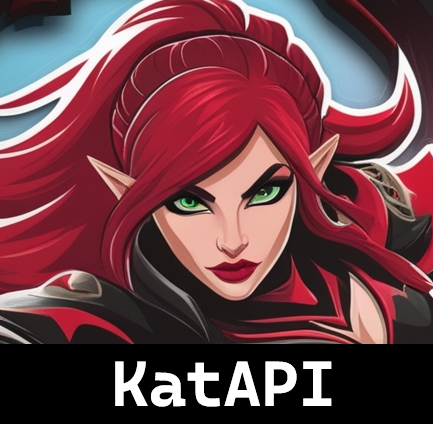

<div align='center' style='display:flex;flex-direction:row;justify-content:center;'>
    
    
    
    
</div>
<br>
<div align='center'>

</div>
<p align='center'>A Java library to simplify Riot API's use.</p>


KatAPI is a Java library designed to simplify integration with Riot Games APIs. It maps API responses directly into Java objects using Retrofit, streamlining the development of applications that interact with Riot’s services.

# Key Features
* Direct mapping of Riot Games API responses to Java objects.
* Built on Retrofit for efficient HTTP requests.
* Compatible with Java 21.
* Supports both Maven and Gradle through JitPack.io.
* Easy integration into any Java project.

## Installation
KatAPI is hosted on JitPack.io. To install it, follow these steps:

### Instalation Steps

#### Maven
Add the JitPack repository to your pom.xml:

```xml
<repositories>
    <repository>
        <id>jitpack.io</id>
        <url>https://jitpack.io</url>
    </repository>
</repositories>
```
Add KatAPI as a dependency:
```xml
<dependency>
    <groupId>io.github.katarem</groupId>
    <artifactId>KatApi</artifactId>
    <version>1.2.1</version>
</dependency>
```
#### Gradle
Add the JitPack repository to your build.gradle file:
```gradle
repositories {
    maven { url 'https://jitpack.io' }
}
```
Add KatAPI as a dependency:
```gradle
implementation 'io.github.katarem:KatApi:1.2.1'
```
## Getting Started
Register as a developer on the Riot Games Developer Portal.
Generate an API Key and configure it in your application.
Basic Setup Example
```java
public class Example {

    public static void main(String[] args) throws Exception {

        Properties p = new Properties();
        InputStreamReader reader = new InputStreamReader(Example.class.getResourceAsStream("/config.properties"), Charset.forName("UTF8"));
        p.load(reader);

        String apiKey = p.getProperty("API_KEY");
        String[] playerName = p.getProperty("ACCOUNT").split("#");
        String version = p.getProperty("VERSION","14.22.1");


        // First we initialize the service with the api key
        LoLService.setApiKey(apiKey);

        LoLService service = new LoLService.Builder()
                .setPlatform(Platform.EUROPE_WEST)
                .setRegion(Region.EUROPE)
                .setLang(Langs.ENGLISH_UK)
                .setVersion(version)
                .forSummoner(playerName[0],playerName[1])
                .build();
    }
}
```
## Usage
### Fetching Summoner Information
```java
Summoner summoner = service.getSummoner();
```
### Fetching Ranked Information
```java
LeagueEntry elo = service.getElo(Queue.RANKED_SOLO_5x5);
System.out.println(elo.getTier() + " " + elo.getRank() + " " + elo.getLeaguePoints() + "LP");
```
### Fetching Masteries
```java
ArrayList<Mastery> masteries = service.getMasteries();
    for (Mastery mastery : masteries) {
        String championName = service.getChampion(mastery.getChampionId().toString()).getName();
        System.out.printf("%s - Mastery [%d] %d points\n",
        championName,
        mastery.getChampionLevel(),
        mastery.getChampionPoints());
    }
```
### Obtaining Winrate from last 20 games
```java
List<GameInfo> games = service.getGames()
    .stream().map(gameId -> {
        try {
            return service.getGame(gameId);
        } catch (Exception e) {
            e.printStackTrace();
            return GameInfo.NULL;
        }
    })
    .filter(game -> game != GameInfo.NULL)
    .filter(game -> {
        var player = game.getInfo().getParticipants().stream()
        .filter(part -> part.getSummonerId().equals(service.getSummoner().getId()))
        .findFirst();
    
        return player.isPresent() ? player.get().getWin() : false;
    })
    .toList();
System.out.printf("%d won games of %s\n",games.size(),service.getGames().size());
            
```
### Get a Specific Champion
```java
Collection<Champion> champs = service.getChampions();
Optional<Champion> champ = champs.stream().filter(e -> e.getName().equals("Katarina")).findAny();
System.out.println(champ.get().getBlurb());
```
### Get Current's game information from a Summoner
```java
Optional<CurrentGame> currentGame = service.getCurrentGame();
if (currentGame.isPresent()) {
    Optional<Participant> par = currentGame
            .get()
            .getParticipants()
            .stream()
            .filter(e -> e.getSummonerId().equals(summoner.getId())).findFirst();
    String currentChamp = champs.stream()
            .filter(e -> e.getKey().equals(par.get().getChampionId().toString()))
            .findFirst()
            .get()
            .getName();
    System.out.println("Current game: " + currentGame.get().getGameMode() + " playing " + currentChamp);
} else
    System.out.println("This summoner isn't inside a game right now");
```
<!-- Add an image or diagram here explaining how KatAPI interacts with Riot's APIs -->
## How it works


KatApi makes HTTP requests to Riot's API and maps the response to Java Beans.

## Contributing
Contributions are welcome! If you'd like to contribute:

Fork the repository.
Create a new branch
```git
git checkout -b feature/new-feature
```
Commit your changes.
```
git commit -m 'Add a new feature'
```
Push your branch
```
git push origin feature/new-feature
```
Open a pull request.
## License
This project is licensed under the GNU License. See the [LICENSE](./LICENSE) file for details.

## Disclaimer
You can check the disclaimer [here](https://www.termsfeed.com/live/cd778ad4-675d-40f8-a4a5-5be2829d2cd1).

## Contact
For questions or feedback, feel free to reach out at crismigesp@gmail.com or open an issue in this repository.
